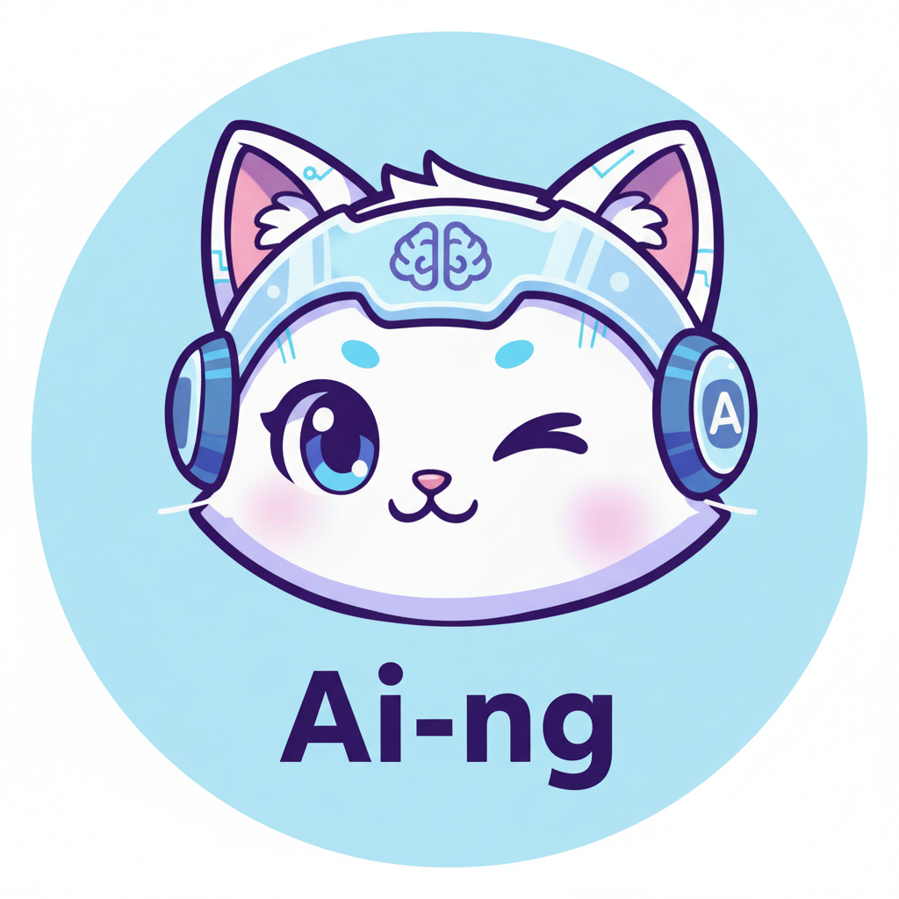
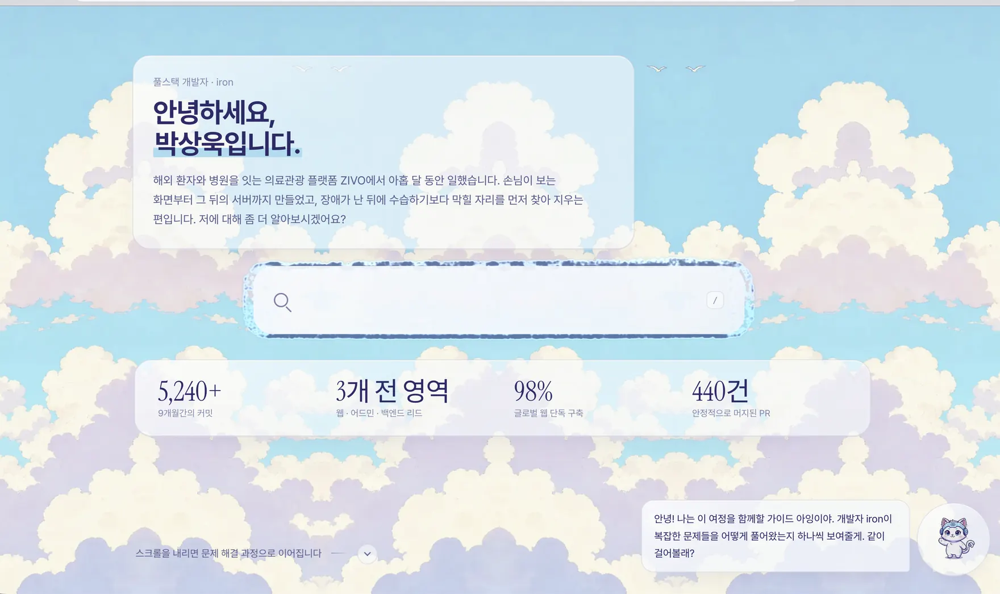
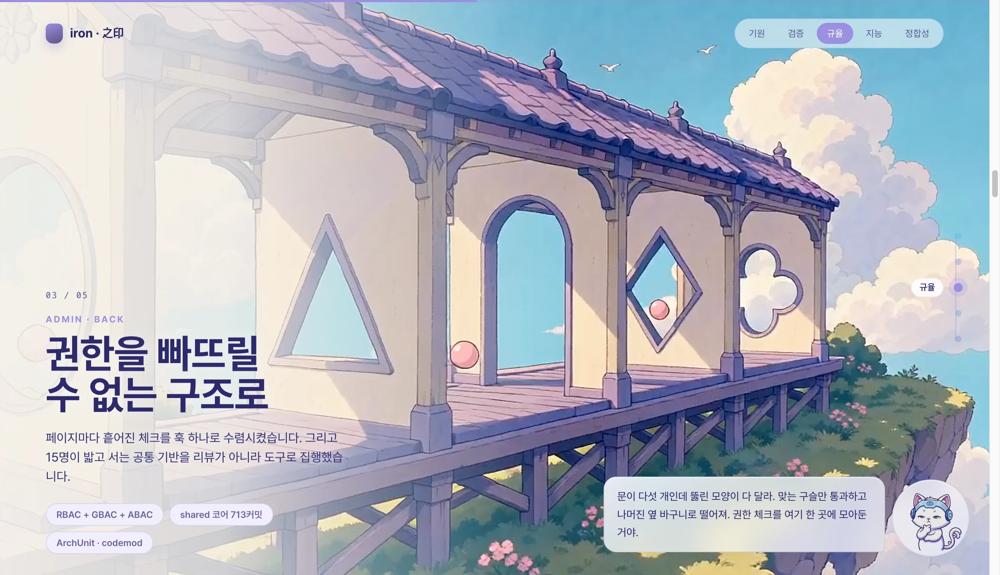
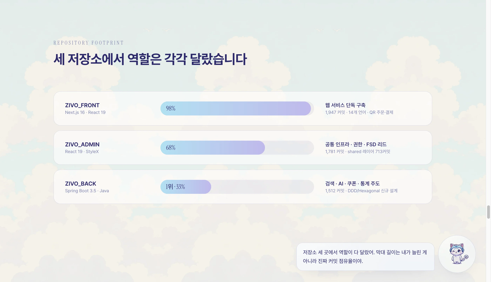
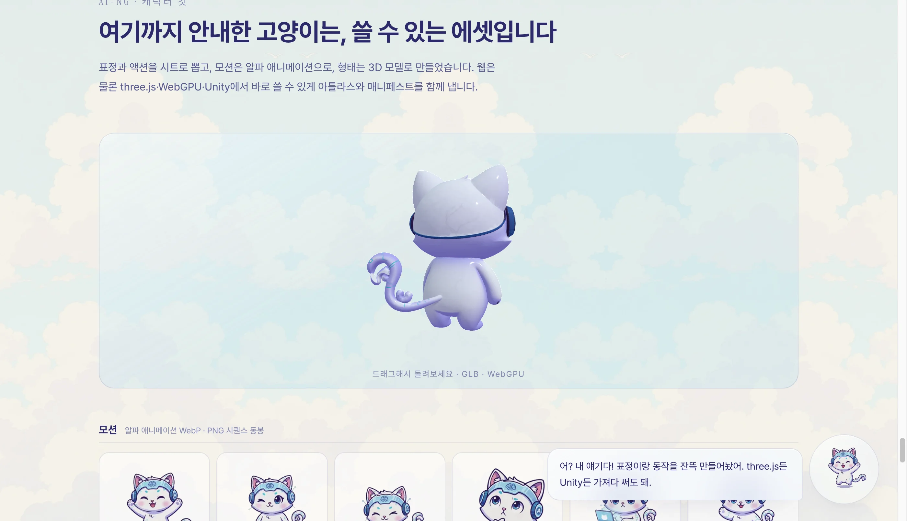
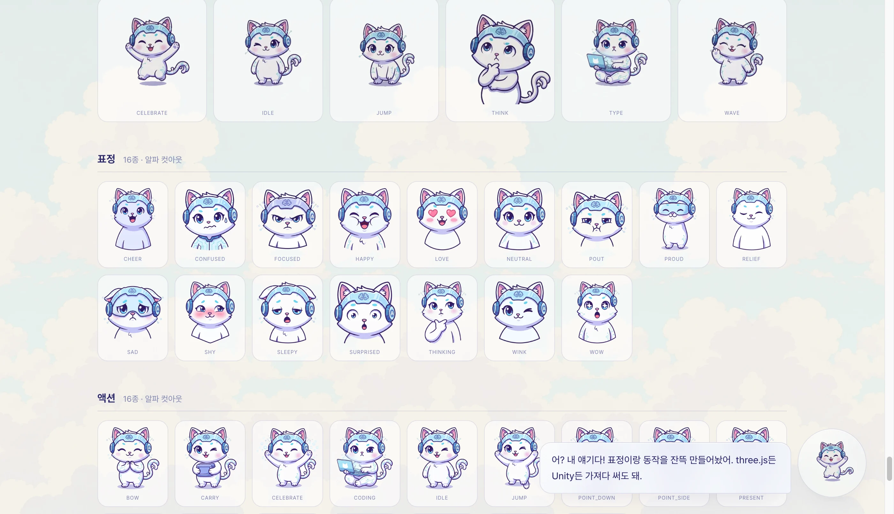

<div align="center">



# 3d-web-resume

**스크롤이 카메라를 움직이는 이력서.**
구름 위에 떠 있는 다섯 개의 섬 안으로 차례로 날아 들어갑니다.
섬 하나가 실제 기여 사례 하나고, 마스코트 **Ai-ng(아잉)** 이 지금 보고 있는 장면을 설명합니다.

<br />


<br />




</div>

---

## 어떻게 동작하나

스크롤은 재생이 아니라 **아잉의 걸음**입니다. 스크롤 위치가 곧 캐릭터의 x 좌표이고, 다섯
장소를 순간이동 없이 걸어서 지나갑니다. 멈추면 아잉도 멈추고 `idle`로 돌아갑니다.

```
[새벽 숲 오두막] → [강의 돌다리] → [문지기 초소] → [언덕 전망대] → [해질녘 창고]
      ↑ 스크롤 위치 = 카메라 x = 아잉의 x
   하늘 0.2 · 배경 0.6 · 지면과 아잉 1.0 · 전경 소품 1.15
```

걷기는 스크롤 속도가 아니라 **시계**가 굴립니다(8fps 고정). 휙 넘겨도 리듬이 무너지지 않습니다.
씬의 글은 캔버스가 아니라 서버가 그린 DOM이고, 화면에 붙잡아 두는 것은 JS가 아니라
`position: sticky`입니다 — 엔진이 없어도, 모션을 줄여 달라고 해도 다섯 장은 그대로 읽힙니다.



---

## 오라클 — 검색창이 그대로 자라 채팅창이 된다

화면 한가운데 유리 검색창이 하나 떠 있습니다. 누르면 **새 창이 열리는 게 아니라 그 판이
그 자리에서 커져** 채팅창이 됩니다. 페이지 이동도, 레이어 교체도 없습니다.

| 층 | 무엇을 하나 |
|---|---|
| **파티클 막** | 16,000개가 rounded-rect 둘레를 목표로 모입니다. 위치·속도는 전부 WebGPU 컴퓨트 셰이더가 계산합니다 |
| **DOM 판** | 항상 확장 크기로 고정하고 `clip-path`만 바꿉니다 — 리플로 0 |
| **내용** | 판 외곽이 거의 완성된 뒤(`morph` 0.72~1.0)에야 헤더 → 로그 → 입력이 차례로 맺힙니다 |

- 둘레를 `u∈[0,1)`로 파라미터화해서 검색창과 채팅창이 **연속으로 대응**됩니다. 그래서 중간 상태가 늘 그럴듯합니다
- 파티클 간 인력·반발은 저해상도 밀도 그리드의 기울기로 O(N) 근사합니다
- 열림 진행률은 스프링입니다. 저프레임에서 명시적 오일러가 발산하므로 **고정 서브스텝**으로 적분합니다
- 플레이스홀더 문구는 신기루처럼 글자 단위로 맺혔다가 증발합니다
- WebGPU가 없으면 파티클 없이 `clip-path` 전환만 남습니다

### 답은 누가 하나

세 갈래 중 되는 것을 위에서부터 씁니다. 어느 쪽이든 **질문은 브라우저 밖으로 나가지 않습니다.**

| 순위 | 엔진 | 조건 |
|:-:|---|---|
| 1 | **Ollama** | 이 컴퓨터에서 돌고 있을 때 (내려받을 것 없음, localhost에서만 탐지) |
| 2 | **브라우저 모델** | Qwen3 0.6B q4f16 **570MB**를 WebGPU로. 진입 즉시 자동으로 받습니다 |
| 3 | **위키** | 모델이 없거나 WebGPU가 없으면 조각을 그대로 인용해 답합니다 |

모델이 하는 일은 *지식을 꺼내는 것*이 아니라 **검색된 위키 문단을 3문장으로 다듬는 것**입니다.
그래서 파라미터 수보다 기다리는 시간이 먼저 체감됩니다 — 기본값은 3.4GB Gemma 4 E2B가 아니라
570MB Qwen3 0.6B입니다(q4f16 실측: 디코더 1.86GB + 임베딩 1.76GB vs 570MB, **6배**).
모델·용량·dtype은 `components/oracle/models.js` 한 곳에 있고 워커와 UI가 같은 표를 봅니다 —
더 큰 1.7B(1.4GB)도 그 표에 있으니 기본을 바꾸려면 순서만 바꾸면 됩니다.

내려받기는 묻지 않습니다. Ollama 탐지가 끝나고 `navigator.gpu`가 있을 때만 시작하므로,
Ollama가 도는 컴퓨터와 WebGPU가 없는 브라우저는 570MB를 건드리지 않습니다 — 세션은 파일을
다 받은 뒤에야 만들어져서, 가드가 없으면 못 쓸 모델을 끝까지 받고 나서 죽습니다.

### 무엇을 근거로 답하나

근거는 셋 다 같은 위키(`lib/wiki.js`) **16개 조각**입니다. PAR 이력서의
Problem·Analyze·Action·Result를 옮겨서, 무엇을 했는지뿐 아니라 **어떤 선택지를 왜 골랐는지**까지 답합니다.

| 갈래 | 조각 |
|---|---|
| 개요 | 종합 프로필 · 세 저장소 포지션 |
| FRONT | 웹 0→1(14개 언어) · 결제 실패 경로 · E2E 하네스 |
| ADMIN | RBAC 하이브리드 권한 · 공통 인프라와 팀 규약 |
| BACK | 도메인 개요 · OpenSearch 재색인 · 멀티 LLM 회복탄력 · 쿠폰 DDD/Outbox |
| 그 외 | 일하는 방식 · 스택 · 이 사이트 · 연락 · **하지 않은 일** |

마지막 조각이 중요합니다. RAG/pgvector는 계획 흔적만 있고 구현이 없으며, 백엔드 결제 코어는
다른 기여자 소유입니다. **모델이 넘지 말아야 할 선을 근거 안에 적어 둡니다.**

검색은 형태소 분석기 없이 돌아갑니다:

- **2-gram으로 조사를 뚫되 한글에만.** 영문 두 글자는 뜻이 없어서 `archunit`의 `ch`가
  `opensearch`에 걸리는 식으로 노이즈만 만듭니다
- **문서 빈도로 흔한 말을 누릅니다.** 없으면 "iron"이 붙었다는 이유로 소개 조각이 1등을 합니다
- **길이 정규화는 완만하게**(BM25의 `b`항). 안 하면 개요 조각이 다 먹고, 제곱근으로 나누면
  반대로 가장 짧은 조각이 아무 질문에나 튀어나옵니다
- **일반 서술어는 불용어로.** "설계"가 어쩌다 한 제목에만 있다는 이유로 희소어 취급을 받으면,
  "쿠폰은 왜 새로 설계했어?"에 결제 조각이 1등을 합니다

```bash
npm run check   # 44개 체크. 엉뚱한 조각이 1등이면 실패
```

---

## 다섯 장소

장소마다 **문제가 먼저** 보이고 그 다음에 그것을 다룬 사물이 보입니다. 도구를 진열하지 않습니다.
사실 전달은 그림 위에 서는 카피가 합니다. 왼쪽에서 오른쪽으로 해가 기웁니다.

| # | 장소 | 무엇이 보이나 | 담긴 이력 |
|:-:|---|---|---|
| 01 | **기원** | 새벽 숲의 오두막, 길을 따라 늘어선 등불 14개 | Front 0→1 · 14개 언어 · QR 주문·결제 |
| 02 | **검증** | 물살이 센데도 흔들리지 않는 돌다리, 같은 돌 10개 더미 | 결제 E2E 하네스 · 플레이크 0 |
| 03 | **규율** | 열쇠 하나로만 열리는 문, 담장의 열쇠고리와 규칙판 | RBAC 하이브리드 권한 · 공통 인프라 |
| 04 | **지능** | 언덕 위 망원경과 아래로 갈라지는 세 갈래 물길 | OpenSearch 재색인 · 멀티 LLM fallback |
| 05 | **정합성** | 이중 자물쇠 창고와 상자를 하나씩 확인하는 우편함 | 쿠폰 DDD/Hexagonal · Outbox |



> 막대 길이는 연출이 아니라 **실제 커밋 점유율**입니다.

---

## Ai-ng 캐릭터 킷


마스코트를 페이지 장식이 아니라 **가져다 쓸 수 있는 에셋**으로 만들었습니다.
전부 `public/mascot/` 아래에 있고, 매니페스트 `aing-kit.json` 하나가 전체를 기술합니다.

| 항목 | 내용 |
|---|---|
| 표정 | **16종** · 알파 컷아웃 WebP |
| 액션 | **16종** · 알파 컷아웃 WebP |
| 모션 | **6종** · 알파 애니메이션 WebP (+ PNG 시퀀스, zip 동봉) |
| 아틀라스 | 256px 균일 그리드 · WebP(웹) + PNG(엔진) + TextureAtlas JSON |
| 3D | `aing.glb` **1.19MB** · `aing-lite.glb` **200KB** (meshopt) |



### 엔진별 사용법

<table>
<tr><td><b>Phaser / PixiJS</b></td><td>

```js
this.load.atlas('aing',
  'mascot/sheets/aing-expr.webp',
  'mascot/sheets/aing-expr.json');
```
</td></tr>
<tr><td><b>Unity</b></td><td>

`sheets/aing-<set>.png` 임포트 → Sprite Mode **Multiple** →
Slice **Grid By Cell Size 256×256**, Pivot **Center**
</td></tr>
<tr><td><b>three.js / WebGPU</b></td><td>

```js
// 아틀라스: 프레임 i → (i % cols, floor(i / cols))
// GLB는 meshopt 압축이라 디코더 등록이 필수
new GLTFLoader().setMeshoptDecoder(MeshoptDecoder)
  .load('mascot/3d/aing.glb', …);
```
</td></tr>
</table>



---

## AEO — 에이전트가 JS 없이 읽는 이력서

이 사이트에서 가장 할 말이 많은 부분은 다섯 장소의 카피입니다. 그런데 그 글은 예전 엔진이
런타임 `innerHTML`로 만들고 있었습니다 — **JS를 돌리지 않는 크롤러에게는 페이지가 통째로
비어 있었다**는 뜻입니다. Next 이관의 본론이 이걸 서버로 옮긴 것입니다.

| 표면 | 무엇을 내나 |
|---|---|
| **HTML** | 다섯 장면의 제목·본문·태그, 저장소 수치, 원칙, 킷 그리드 전부 서버 렌더. 엔진은 이 마크업을 **읽기만** 하고(씬 경계와 스크롤 길이를 여기서 가져옵니다) 글은 건드리지 않습니다 |
| **JSON-LD** | `ProfilePage` · `Person` · `ItemList`×2 · `FAQPage`. **화면에 실제로 보이는 글만** 올립니다 — 위키는 안 보이므로 FAQ로 올리지 않습니다 |
| **`/iron.md`** | 이력서 전문 Clean Markdown (~16KB). 페이지와 **같은 상수**에서 생성되어 어긋날 사본이 없습니다 |
| **`Accept: text/markdown`** | 홈 요청을 rewrite로 `/iron.md`에 연결(`proxy.js`). URL은 그대로라 에이전트가 인용하는 주소 = 사람이 여는 주소. `Vary: Accept` |
| **`/llms.txt`** · **`/llms-full.txt`** | 색인과 전문. 역시 `lib/markdown.js`가 생성 |
| **`robots.txt`** | GPTBot·ClaudeBot·PerplexityBot 등 16종을 **이름으로** 허용. 와일드카드만 두면 색인을 건너뛰는 봇이 있습니다 |

```bash
curl -H "Accept: text/markdown" https://…/     # 3D 세계 대신 마크다운 전문
```

---

## 성능

| 지표 | 값 |
|---|---|
| 초기 번들 | **185KB gzip** — three.js·픽셀 엔진·파티클 막·모델은 전부 필요할 때만 |
| 3D 모델 | 54.44MB → **1.19MB** (simplify + meshopt + 텍스처 WebP) |
| 픽셀 에셋 | 26장 **772KB** (배경 5 · 소품 10 · 아잉 8 · 공용 3), 영상 세계 1.19MB의 65% |
| 파비콘 | 1.5MB → **52KB** (1024px 원본이 그대로 들어가 있었습니다) |

> **번들이 74KB에서 185KB로 늘었습니다.** App Router 런타임의 값이고, 그 대가로 산 것이
> 위의 AEO 표입니다. 에이전트에게는 초기 JS가 0이므로 이 거래는 그쪽에서 이득입니다.
> Lighthouse 재측정은 Vercel 배포 후에 해야 의미가 있어 이전 수치는 내렸습니다.

몇 가지 결정:

- **three는 한쪽만 받습니다.** `three/webgpu`는 코어를 재export하므로 `three`와 같이 import하면
  같은 라이브러리를 두 벌(~190KB gzip) 내려받게 됩니다. 엔트리를 먼저 고르고 나서 import합니다.
- **전면 섹션의 `backdrop-filter`는 걷어냈습니다.** 24,000px 페이지에서 그 면적을 블러하면
  스크롤마다 실제 프레임을 잃습니다. 블러는 작은 글래스 카드에만 남겼습니다.
- **하늘은 `background-attachment: fixed`가 아니라 실제 고정 엘리먼트**입니다. 전자는
  스크롤 틱마다 배경 전체를 다시 칠합니다.

---

## 스택

- **Next.js 16.3 App Router + React 19** — 본문은 전부 서버 컴포넌트. 클라이언트로 넘어가는 것은
  다섯 조각뿐입니다: `CoverParallax`(포인터) · `WorldMount`(엔진) · `Oracle`(WebGPU+워커) ·
  `Live3D`(GLB) · `Guide`(스크롤 위치)
- **픽셀 여정 엔진** — 의존성 0의 바닐라 JS 195줄(`lib/pixel-journey.js`). 스크롤을 카메라
  좌표로 바꿔 레이어 넷을 서로 다른 속도로 밀 뿐입니다. 씬의 글과 스크롤 길이는 서버가 그린
  마크업이 쥐고 있고, 붙잡는 것은 CSS입니다
- **씬 / 스프라이트** — Higgsfield `gpt_image_2` + `nano_banana_2`, 16-bit 픽셀 아트.
  1024×512 파노라마 5장은 지평선을 화면 하단 38%로 고정해 장소가 바뀌어도 땅이 튀지 않습니다
- **캐릭터** — `nano_banana_2_lite`(1크레딧/장)로 시트, 원본 Ai-ng를 레퍼런스로 정체성 고정
- **3D** — `tripo_h3_1_image_to_3d` → `gltf-transform`으로 최적화

---

## 개발

```bash
npm install
npm run dev      # http://localhost:3000
npm run build    # .next/
npm start        # 프로덕션 서버

npm run check    # 위키 검색 회귀 체크 44건 (프레임워크 없음)
```

배포는 Vercel입니다. `NEXT_PUBLIC_SITE_URL`을 두면 그 값이, 없으면 Vercel이 주는
`VERCEL_PROJECT_PRODUCTION_URL`이 canonical·sitemap·JSON-LD의 기준이 됩니다 —
프리뷰 배포가 스스로를 정본이라 주장하지 않도록 하드코딩하지 않았습니다(`lib/site.js`).

변경 이력과 결정 근거는 [CHANGELOG.md](CHANGELOG.md)에 있습니다.

---

## 에셋 파이프라인

원본은 `.world/`(git 제외)에 있고, 아래 스크립트가 `public/`으로 굽습니다.

```bash
# 월드
python3 .world/prep_assets.py                       # 씬 → webp 포스터
python3 .world/build_sky.py s4.png 0.80 1.0         # 씬의 하늘 열을 거울 타일링 → 무이음 배경
bash    .world/encode.sh                            # 클립 → crf26/GOP10, faststart, 무음

# 캐릭터 킷
bash    .world/kit.sh                                # 표정 16 + 액션 16
python3 .world/knockout.py IN.png OUT.webp --white   # 배경 녹아웃 (--checker 모드도 있음)
bash    .world/motion.sh                             # 모션 6종 (흰 배경 · 고정 카메라)
python3 .world/build_motion.py kit/motion/idle.mp4 --pingpong --fps 10 --size 256 --seconds 3
python3 .world/build_kit.py                          # 아틀라스 + 매니페스트 + zip

# 3D
npx gltf-transform optimize in.glb out.glb --compress meshopt \
  --texture-compress webp --texture-size 2048 --simplify true --simplify-error 0.0002
```

### 파이프라인에서 배운 것

- **생성 모델에 "투명 배경"을 요구하면 체커보드를 실제 픽셀로 그려버립니다.**
  흰 배경으로 뽑고 로컬에서 플러드필로 벗기는 쪽이 안정적입니다. 캐릭터의 진한 외곽선이
  실루엣을 닫아주기 때문에, 몸통이 흰색이어도 채우기가 안으로 새지 않습니다.
- **영상에서 알파를 뽑을 때는 압축 노이즈가 남습니다.** 임계만 넓히면 선이 깎이므로,
  연결요소 면적 필터로 작은 조각만 지웁니다.
- **루프는 핑퐁으로 닫습니다.** 모델이 첫 프레임으로 정확히 돌아오게 만드는 것보다,
  정방향 뒤에 역방향을 붙이는 쪽이 확실하고 공짜입니다.

---

## 사실 정확성

숫자는 전부 세 저장소(`ZIVO_FRONT` / `ZIVO_ADMIN` / `ZIVO_BACK`)의 git 이력 분석에서 나온
실측치입니다. **지어낸 지표는 없습니다.** 검증되지 않은 항목은 아예 넣지 않았습니다.

---

<div align="center">

**박상욱 (iron)** · ZIVO Medical Tourism Platform · 2025.10 – 2026.07

[sangwookp9591@gmail.com](mailto:sangwookp9591@gmail.com)

</div>
